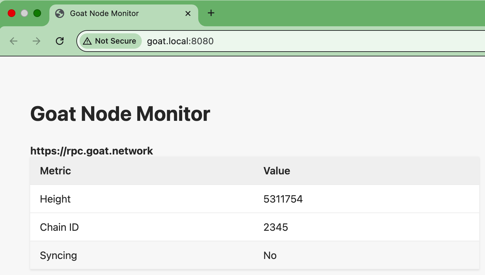

# Building and Running the Docker Image Locally

To build the Docker image for `goat-monitor`, execute:

```sh
docker build -t goat-monitor .
```

To run the container with the default `GOAT_RPC_NODE` (defaults to `https://rpc.goat.network`):

```sh
docker run -p 8080:8080 goat-monitor
```

To specify a custom `GOAT_RPC_NODE` endpoint:

```sh
docker run -e GOAT_RPC_NODE=https://rpc.ankr.com/goat_mainnet -p 8080:8080 goat-monitor
```

## Example: Accessing the Application Locally

After running the container, open your browser and navigate to [http://localhost:8080](http://localhost:8080). You should see the goat-monitor UI:


---

# Deploying to a Kubernetes Environment

## 1. Push the Docker Image to Your Registry

If you are using a local [kind](https://kind.sigs.k8s.io/) cluster, load the image with:

```sh
kind load docker-image goat-monitor --name goat-monitor
```

## 2. Apply Kubernetes Manifests

Apply the following YAML files in order:

1. `k8s/secret.yaml`
2. `k8s/deployment.yaml`
3. `k8s/service.yaml`
4. `k8s/ingress.yaml`  
  > **Note:** Update `spec.rules.host` in the ingress manifest to match your environment.

## 3. Access the Application

Once deployed, access the application using the hostname specified in your ingress configuration (`spec.rules.host`).

### Example: Accessing the Application via Ingress

After deploying and configuring ingress, open your browser and navigate to the hostname you set in your ingress manifest. You should see the goat-monitor UI:

